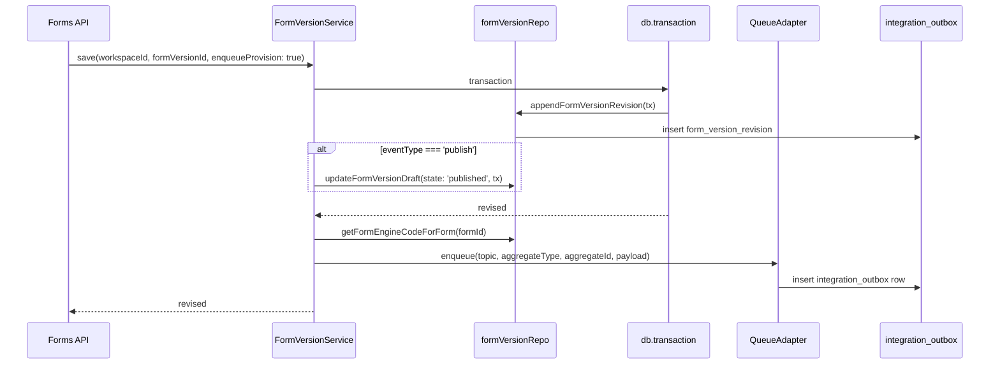

# Core and Drizzle — Deep Dive

Detailed walkthrough of core layers, request flow, schema organization, repos, and Drizzle usage. For a quick orientation see [Core overview](core-overview.md); for the datamodel see [Datamodel](datamodel.md).

## Workspaces, personal vs enterprise, and plugins

### Why workspaces

**Workspaces** are the primary scope for all product data: forms, form versions, submissions, memberships, and groups live in a workspace. They give multi-tenant isolation, a clear ownership model (workspace has an owner; members have roles), and a single place to hang permissions and plugin-specific data. Every request that touches forms or submissions is resolved to a workspace (and the current user’s membership) so the rest of the stack can stay workspace-scoped.

**How we achieve multi-tenancy:** Multi-tenancy is a principal design choice — we do not share tenant data across workspaces. We enforce it by **siloing every query and access path by `workspace_id`**. Tenant-scoped tables (form, form_version, submission, workspace_membership, workspace_group, integration_outbox, and plugin tables) all have a `workspace_id` column. The middleware resolves the request to a single workspace (and checks the user’s membership); services and repos then pass that `workspace_id` into every list, get, create, and update. No API or repo is allowed to read or write rows for a different workspace. Cross-tenant access is therefore impossible at the data layer.

### Why personal vs enterprise

We support two deployment/usage modes, reflected in **workspace kind** (`personal` | `enterprise`) and in which **plugins** are enabled:

- **Personal (local)** — Standalone or local use. Users have a “home” workspace; workspace context can come from cookie or header (unknown how to implement). Invites, per-workspace settings, and audit are handled by the **personal** plugin (tables: `personal_workspace_settings`, `personal_invite`, `personal_audit`). No external identity or workspace provider.
- **Enterprise (e.g. cstar)** — Integrated with an external identity/workspace provider. Workspace context is resolved from provider headers ( or JWT?); workspace, membership, and group records in Soba are **bound** to the provider’s entities via the **enterprise** plugin (tables: `enterprise_workspace_binding`, `enterprise_membership_binding`, `enterprise_group_binding`, plus sync cursors and logs). Sync jobs and bindings keep Soba aligned with the external system. Or on demand (login) per user sync.

So: **personal** = local, self-service workspaces; **enterprise** = provider-backed workspaces (e.g. C-Star) with bindings and sync.

A single user can own ONE personal workspace but belong to or select any number of other personal workspaces or enterprise workspaces.

### How plugins keep a single interface

Core does **not** hard-code “local” vs “cstar”. It defines **interfaces** (e.g. `WorkspaceResolver`: resolve workspace from request; plugin APIs; form engine; cache; message bus). **Plugins** implement those interfaces:

- **personal-local** — Implements `WorkspaceResolver` with `kind: 'personal'`: cookie/header + fallback to home workspace; only resolves workspaces with `kind = 'personal'`.
- **enterprise-cstar** — Implements `WorkspaceResolver` with `kind: 'enterprise'`: resolves from provider headers, looks up `enterprise_workspace_binding` (provider_code `cstar`); only resolves workspaces with `kind = 'enterprise'`.

The registry discovers plugins from the `plugins/` dir; config (`WORKSPACE_PLUGINS_ENABLED`, etc.) decides which are enabled and in what order. The application always talks to “the workspace resolver” and “plugin APIs” the same way. So we can support **local (personal)** and **cstar (enterprise)** — and future backends — while keeping a **consistent, singular interface** for the application. New deployment modes = new plugins implementing the same contracts, not branching core.

**Dependency rule: core must not reference plugins.** Core must never import a plugin directly or depend on any specific plugin implementation (e.g. `personal-local`, `enterprise-cstar`, `formio-v5`, `cache-memory`). Core only depends on **interfaces** and on the **plugin registry** (or equivalent), which resolves implementations by **code** from config/env at runtime. Plugin code lives under `backend/src/plugins/` and is loaded by the registry; the app or startup layer wires which plugins are enabled. This is the same principle as for features: core stays agnostic so it can be reused and tested without pulling in any particular plugin.

---

## Features, feature flags, and migrations

### Features are vertically sliced

**Features** are optional, vertically sliced units of product capability. A feature can contain:

- **APIs** — Routes, controllers, and handlers mounted by the application (e.g. under `/api/v1` or a feature-specific path).
- **DB schemas / models** — Drizzle tables and types that live in the feature's schema module (or a shared feature schema entry point).

Features are the right place for product-specific behaviour that builds on core; core stays stable and feature-agnostic.

### Dependency rule: features → core, not core → features

- **Features may reference core** — They can import from `backend/src/core/` (services, repos, auth, config, integrations, etc.) and use core types and APIs.
- **Core must not reference features** — Core must not import from `backend/src/features/` (or any feature namespace). Mounting and wiring of features is done at the application or route layer (e.g. `app.ts`, `routes/index.ts`), not inside core. This keeps core reusable and testable without pulling in feature code.

### Feature flags

**Feature flags** (env vars, config, or runtime config) determine whether a feature is **enabled** at runtime. When a feature is disabled, its routes are not mounted (or are no-ops) and its behaviour is not invoked; its code and schema still exist in the build. Flags allow the same deployment to run with different feature sets (e.g. by environment or tenant) without separate builds.

### Migrations include all feature tables

**DB migrations are generated from the full schema** — i.e. core schema plus all feature schemas that are part of the Drizzle schema entry point. So **migrations always include every feature table**, even when the feature is not enabled. Applying migrations ensures the database has all tables; feature flags only control whether the application uses those tables at runtime. Disabling a feature does not remove or skip its tables in the migration set. This avoids conditional migrations and keeps schema and migration history consistent across environments regardless of which features are turned on.

---

## Core layers

### API

- **Location:** `backend/src/core/api/`
- **Domains:** Forms, submissions, meta. Each domain has a router, controller(s), service factory, and OpenAPI registration.
- **Shared:** `shared/openapi.ts`, `shared/pagination.ts`, `shared/asyncHandler.ts`, `shared/types.ts`
- **Mounting:** In `app.ts`, core is mounted at `/api/v1` with `express.json()` and JWT middleware. Meta is public; forms and submissions require a valid JWT and core context (workspace/membership).

### Auth

- **Location:** `backend/src/core/auth/` (profile helpers); auth middleware and IdP plugin discovery live in `backend/src/auth/` and `backend/src/middleware/` so core does not depend on plugin implementations.
- **IdP (auth source) plugins:** Token validation and claim mapping are provided by **IdP plugins**, not by core. The contract is in `auth/IdpPlugin.ts` (`IdpPluginDefinition`: code, `createAuthMiddleware(config)`, `createClaimMapper(config)`). Discovery and composite middleware are in `auth/idpRegistry.ts`; plugins export `idpPluginDefinition` from `backend/src/plugins/` (e.g. `idp-bcgov-sso`, `idp-github`). Config: `IDP_PLUGINS` (comma-separated, ordered list) or `IDP_PLUGIN_DEFAULT_CODE`. The composite auth middleware tries each IdP plugin in order; the first to succeed sets `req.idpPluginCode` and `req.authPayload`.
- **Actor resolution:** After auth, `middleware/actor.ts` uses the active plugin’s `claimMapper.mapPayload(payload)` and `findOrCreateUserByIdentity(providerCode, subject, profile, idpAttributes)` to set `req.actorId`. **Workspace and membership are not in the token** — they are resolved by **workspace resolver plugins** and `membershipRepo` in `resolveCoreContext` (request context).
- **jwtClaims:** Core’s `core/auth/jwtClaims.ts` defines profile shape and helpers (`NormalizedProfile`, `profileHelpers` for displayLabel, displayName, email, etc.). IdP plugins populate these when mapping; core does not parse IdP-specific claims.

**Request auth and context flow:** IdP (auth source) plugins validate the JWT and set `req.idpPluginCode` and `req.authPayload`; actor middleware uses the plugin’s claim mapper and `findOrCreateUserByIdentity` to set `req.actorId`; core request context then resolves workspace and membership via workspace resolver plugins and DB.

```mermaid
sequenceDiagram
  participant Client
  participant IdPAuth as "IdP auth middleware"
  participant Actor as resolveActor
  participant ReqCtx as resolveCoreContext
  participant Resolvers as "Workspace resolvers"

  Client->>IdPAuth: Request + JWT
  IdPAuth->>IdPAuth: Try IdP plugins in order
  IdPAuth->>Actor: req.idpPluginCode, req.authPayload
  Actor->>Actor: claimMapper.mapPayload then findOrCreateUserByIdentity
  Actor->>ReqCtx: req.actorId
  ReqCtx->>Resolvers: resolve workspace from request
  Resolvers->>ReqCtx: workspaceId, source
  ReqCtx->>ReqCtx: getWorkspaceForUser, set coreContext
```

### Config

- **Location:** `backend/src/core/config/`
- **Role:** Env loading (`env.ts` — database URL, pool size, feature flags, etc.), plugin configuration. Env is loaded at process entry (e.g. `app.ts`) before any DB or config-dependent code runs.

### Container

- **Location:** `backend/src/core/container.ts`
- **Role:** Composition root. Wires the message bus, outbox queue adapter, FormService, FormVersionService, SubmissionService, and the API service factories (forms, submissions). SyncService is created lazily with form-engine adapter and repo helpers. Exposes `getCache()` and `getSyncService()` for code that needs them. API and workers import from the container so the dependency graph stays in one place.

### Database

- **Location:** `backend/src/core/db/`
- **Client:** `client.ts` — creates a `pg` Pool from env, then `drizzle(pool, { schema, logger: drizzleQueryLogger })`. Exports `db`, `Db`, `Tx`, `DbOrTx`, `pool`.
- **Schema:** Re-exported from `schema/index.ts` (core, forms, integration, plugins). All tables live in the Postgres schema `soba`.
- **Repos:** One or more modules per domain (formRepo, formVersionRepo, submissionRepo, workspaceRepo, membershipRepo, outboxRepo, appUserRepo; plugin repos under `repos/plugins/`).
- **Migrations:** `migrate.ts` ensures the database exists (optional admin connection), then runs `migrate(db, { migrationsFolder: 'drizzle' })`. Migrations are generated into `backend/drizzle/` by drizzle-kit.
- **Seed:** `seed.ts` for initial data (e.g. identity provider, dev users).
- **Extras:** `appUserView.ts` (view/helpers for app user display), `queryLogger.ts` (Drizzle logger for dev/debug).

### Integrations

- **Location:** `backend/src/core/integrations/`
- **Adapters:** Cache, message bus, queue (DbOutboxQueueAdapter writing to `integration_outbox`), form engine (FormEngineRegistry). Plugins are registered and provide implementations.
- **Default plugins and expected implementations:**
  - **Auth source (IdP)** — Configured via `IDP_PLUGINS` (or `IDP_PLUGIN_DEFAULT_CODE`); discovered from the same `plugins/` dir via `idpPluginDefinition`; **separate from the plugin registry**. Each IdP plugin provides auth middleware and a claim mapper. Examples: `idp-bcgov-sso`, `idp-github`. The plugin registry (below) handles workspace, cache, message bus, and form engine only.
  - **Workspace** — At least one resolver is required (`WORKSPACE_PLUGINS_ENABLED`). Expected: `personal-local` (kind personal), `enterprise-cstar` (kind enterprise). Others can implement `WorkspaceResolver` and be composed in order.
  - **Cache** — Env `CACHE_DEFAULT_CODE`; if unset, falls back to `cache-memory`. Expected: `cache-memory` (in-memory, for dev/single-instance). Production may use a Redis or similar plugin.
  - **Message bus** — Env `MESSAGEBUS_DEFAULT_CODE`; if unset, falls back to `messagebus-memory`. Expected: `messagebus-memory` (in-memory; publish is effectively a no-op; outbox worker drives async work). Production may use a real broker plugin (NATS or Redis or other...).
  - **Form engine** — See below. Env `FORM_ENGINE_DEFAULT_CODE` sets the default for new forms; if unset and `formio-v5` is installed, defaults to `formio-v5`. Multiple form engine plugins can be installed and used side-by-side.
- **Form engine:** Forms declare a `form_engine_code`; the registry holds **all** discovered form engine plugins (by code). At runtime the registry returns the adapter for a form’s `form_engine_code`. So **many form engines can be deployed side-by-side** — each form is tied to one engine; different forms in the same workspace can use different engines. Form versions and submissions store engine refs and sync status; SyncService and the outbox worker drive provisioning and sync. The **current default** for new forms (when no code is specified) is **Form.io v5** (`formio-v5`).

### Middleware

- **Location:** `backend/src/core/middleware/`
- **Request context:** Sets up core context (e.g. workspace, user) for the request.
- **Error handler:** Core API error handler (maps domain errors to HTTP status and body).
- **Require core context:** Ensures core context is present before forms/submissions routes run.

### Services

- **Location:** `backend/src/core/services/`
- **FormService:** Form CRUD (create, update, list, get, soft delete) via formRepo.
- **FormVersionService:** Form version drafts, save (revision + optional publish), delete, get, list. Uses formVersionRepo and, when “provision” is requested, enqueues a form-version create event to the outbox.
- **SubmissionService:** Submission create, update draft, save revision, delete, get, list. Uses submissionRepo and can enqueue submission events.
- **SyncService:** Consumes form-engine and outbox; updates form version and submission sync state (provisioning/ready/error). Uses system user for background actions.

### Workers

- **Location:** `backend/src/core/workers/`
- **Outbox worker:** Claims batches from `integration_outbox`, invokes handlers by topic (e.g. form version create), then marks events succeeded or failed with retry backoff. Ensures async integration work is processed at least once.

### Integration outbox (Postgres)

- **What it’s for:** Our **business data** (forms, form versions, submissions, revisions) lives in **Postgres**. The form engine (e.g. Form.io) keeps **schema and submission records in its own repository** (e.g. Mongo). The outbox is the reliable bridge: when we write or publish in Postgres we enqueue events; the worker provisions or syncs the corresponding schema/submission data into the external form engine so both sides stay in sync. **Engine refs:** `form_version.engine_schema_ref` and `submission.engine_submission_ref` store the form engine’s IDs for those records — e.g. Form.io MongoDB `_id` for the schema and submission documents — so we can target updates and keep Soba and the engine aligned.
- **Implementation:** `integration_outbox` is a **Postgres table** in the `soba` schema (defined in `schema/integration.ts`). The queue adapter (`DbOutboxQueueAdapter`) and `outboxRepo` insert, claim, and update rows there.
- **Why Postgres:** Transactional outbox pattern. Domain writes (e.g. form version revision, publish) and the outbox insert run in the **same database transaction**. If the transaction commits, the event is durable in the same store as the business data; no separate message broker that could miss the event. A worker then claims batches (e.g. `FOR UPDATE SKIP LOCKED`), processes them, and marks them done or failed with backoff. This gives at-least-once delivery and avoids losing events if the process dies before publishing to an external bus.

---

## Request flow example: save form version (with provision)



Later, the outbox worker claims the row, calls the form-engine handler (e.g. provision form version in Form.io), then marks the outbox event done or failed.

---

## Schema organization

- **Single Postgres schema:** `soba`. All tables are in this schema.
- **Schema files:**
  - `core.ts` — identity_provider, app_user, user_identity, workspace, workspace_membership, workspace_group, workspace_group_membership
  - `forms.ts` — form, form_version, form_version_revision, submission, submission_revision
  - `integration.ts` — integration_outbox
  - `plugins.personal.ts` — personal_workspace_settings, personal_invite, personal_audit
  - `plugins.enterprise.ts` — enterprise_workspace_binding, enterprise_membership_binding, enterprise_group_binding, enterprise_sync_cursor, enterprise_sync_log
- **Forms and submissions: no resource-level roles or permissions.** We have not modelled roles or permissions on forms or submissions. Access is currently implied by workspace membership (and, in enterprise, by groups). Fine-grained access (e.g. per-form or per-submission roles such as viewer/editor, or permission flags) can be added later if needed.
- **Types:** `types.ts` defines canonical status/state unions (`FormStatus`, `FormVersionState`, `FormVersionEngineSyncStatus`, `OutboxStatus`, `WorkspaceMembershipStatus`, `WorkspaceMembershipRole`) used in schema and API. DB can enforce these via CHECK constraints.

---

## Repos

| Repo                                  | Purpose                                                                                                                                            |
| ------------------------------------- | -------------------------------------------------------------------------------------------------------------------------------------------------- |
| `formRepo`                            | List forms by workspace, get by id, create, update, mark deleted, get form_engine_code for a form                                                  |
| `formVersionRepo`                     | Create draft, get by id, list by workspace, update draft, append revision, mark deleted                                                            |
| `submissionRepo`                      | Create submission, get by id, list by workspace, update draft, append revision, mark deleted                                                       |
| `workspaceRepo`                       | Ensure home workspace for a user                                                                                                                   |
| `membershipRepo`                      | Resolve user from identity, find/create user by identity, actorBelongsToWorkspace, getWorkspaceForUser, invalidate cache, list workspaces for user |
| `outboxRepo`                          | enqueueOutboxEvent, claimOutboxBatch, markOutboxSucceeded, markOutboxFailed                                                                        |
| `appUserRepo`                         | findUserIdByEmail (and related app user lookups)                                                                                                   |
| `repos/plugins/personalSettingsRepo`  | getPersonalWorkspaceSettings                                                                                                                       |
| `repos/plugins/enterpriseBindingRepo` | findWorkspaceByEnterpriseExternalId and related enterprise bindings                                                                                |

Repos accept optional `DbOrTx` for use inside `db.transaction()`.

---

## Drizzle usage

- **Config:** `backend/drizzle.config.ts` — schema from `./src/core/db/schema/index.ts`, migrations out to `./drizzle`, dialect `postgresql`, `strict: true`, `verbose: true`. DB URL from env (with dotenv).
- **Client:** One pool and one `drizzle` instance with full schema and query logger. Use `db` for queries and `db.transaction(callback)` for transactions. Repo functions that support transactions take an optional second argument `tx?: DbOrTx`.
- **Generate:** `npm run db:generate` runs drizzle-kit generate; new migration files appear in `drizzle/`.
- **Migrate:** `npm run db:migrate` runs `tsx src/core/db/migrate.ts`, which loads env, ensures DB exists, then runs Drizzle migrate against the `drizzle` folder.

---

## Links

- [Core overview](core-overview.md) — high-level highlights and architecture
- [Datamodel](datamodel.md) — ERD and table list for the `soba` schema
