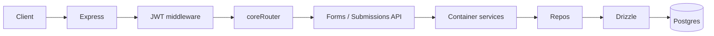
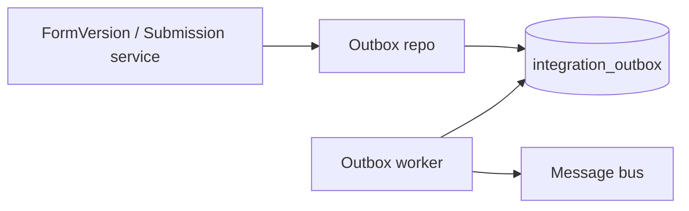

# Core and Drizzle — Overview

Quick orientation for product owners and developers: what “core” is, how Drizzle fits in, and where to find things.

## What is “core”?

**Core** is the shared backend kernel under `backend/src/core/`. It provides:

- **API** — Forms, submissions, and meta endpoints (OpenAPI, pagination, JWT-protected under `/api/v1`)
- **Auth** — JWT validation and claims (workspace, membership, roles)
- **Config** — Environment loading and plugin configuration
- **Database** — Drizzle schema, repos, migrations, seed, and query logging
- **Integrations** — Pluggable adapters: cache, message bus, outbox queue, form engine, plugin registry. Default implementations: **cache-memory**, **messagebus-memory** (in-memory; outbox worker drives async work). **Form engine:** multiple engines can be deployed side-by-side; each form has a `form_engine_code` and the registry returns the adapter for that code. Current default is **Form.io v5** (`formio-v5`); configurable via `FORM_ENGINE_DEFAULT_CODE`.
- **Middleware** — Request context, error handling, core-context requirements
- **Services** — Form, form version, submission, and sync services
- **Workers** — Outbox worker for async integration events

All core API and workers are wired through a single **composition root** (`container.ts`) so dependencies are explicit in one place.

## What is Drizzle here?

**Drizzle** is the ORM and migration tooling for Postgres:

- **Schema** lives in `backend/src/core/db/schema/` (single Postgres schema: `soba`)
- **Migrations** are generated and stored in `backend/drizzle/`
- **Commands:**
  - `npm run db:generate` — generate migrations from schema changes (drizzle-kit)
  - `npm run db:migrate` — apply migrations (runs `src/core/db/migrate.ts`)

The app uses a shared Drizzle client (pool + logger) and exports types like `Db`, `Tx`, and `DbOrTx` for transactional repos.

## Architecture (high level)

Async flows (same DB, different process):

## Key concepts

- **Multi-tenancy** — Multi-tenancy is a core design principle for Soba: each tenant’s data must be isolated. We achieve it by **siloing all data access and queries by `workspace_id`**. The request is resolved to a workspace (and the current user’s membership); every API and repo query that reads or writes tenant data is scoped to that workspace’s id. Tenant-scoped tables (forms, submissions, memberships, groups, plugin data, outbox) all carry `workspace_id`; there are no cross-workspace queries. See [Core deep dive](core-deep-dive.md) for how workspace resolution and scoping work.

- **Workspace-scoped data** — Workspaces own forms, submissions, memberships, and groups. Most APIs and queries are scoped by workspace (and current user’s membership).

- **Personal vs enterprise** — Workspaces have a **kind** (`personal` | `enterprise`). **Personal** is for standalone/local use (home workspace, invites/settings/audit via the personal plugin). **Enterprise** is for integration with an external provider (e.g. C-Star): workspace/membership/group **bindings** and sync are provided by the enterprise plugin. Plugins implement the same core interfaces (e.g. `WorkspaceResolver`) so the app has one consistent interface whether running local (personal) or integrated (enterprise). See [Core deep dive](core-deep-dive.md) for the full picture.

- **Form engine abstraction** — Forms have a `form_engine_code`; form versions and submissions store engine-specific refs (`engine_schema_ref`, `engine_submission_ref`) and sync status. **Many form engines can be deployed side-by-side**: each form is bound to one engine by code; the registry looks up the adapter for that code at runtime. The current default for new forms is **Form.io v5** (`formio-v5`), configurable via `FORM_ENGINE_DEFAULT_CODE`. Other engines can be added as plugins without changing core schema.

- **Outbox pattern** — Async integration events are written to `integration_outbox` (topic, aggregate, payload, status, retries). A worker claims and processes them, then updates status. This gives at-least-once delivery and avoids losing events if the process dies.

- **Plugins** — Optional extensions add tables and behaviour. **Workspace** (required): at least one resolver, e.g. `personal-local`, `enterprise-cstar`. **Cache** and **message bus**: default to `cache-memory` and `messagebus-memory` (in-memory adapters) when not overridden by env. **Form engine**: multiple plugins can be installed; default for new forms is Form.io v5. **Core must not reference a plugin directly or any specific plugin implementation** — core only uses interfaces and the registry (which resolves by code from config); same dependency rule as for features. See [Core deep dive](core-deep-dive.md) for plugin types and expected implementations.

- **Features and feature flags** — **Features** are vertically sliced: each feature can include its own APIs and DB schemas/models. Features may **reference core**; **core must not reference features**. Feature flags (e.g. env or config) control whether a feature is enabled at runtime. **DB migrations always include all feature tables** — the migration set is built from the full schema (core + all feature schemas), so every feature table is migrated regardless of whether the feature is enabled; flags only control runtime activation. See [Core deep dive](core-deep-dive.md).

## Where to find things

| Area             | Location                                                                                                                                  |
| ---------------- | ----------------------------------------------------------------------------------------------------------------------------------------- |
| API routes       | `backend/src/core/api/` — forms, submissions, meta                                                                                        |
| Features         | `backend/src/features/` — vertically sliced features (APIs, optional schemas); mounted by app/routes, not by core                        |
| Schema & types   | `backend/src/core/db/schema/` — core, forms, integration, plugins; feature schemas (if any) included in same migration set               |
| Repos            | `backend/src/core/db/repos/` — form, formVersion, submission, workspace, membership, outbox, appUser; plugin repos under `repos/plugins/` |
| Composition root | `backend/src/core/container.ts`                                                                                                           |
| Migrations       | `backend/drizzle/` — SQL and journal                                                                                                      |
| Drizzle config   | `backend/drizzle.config.ts`                                                                                                               |

## Next steps

- **Detail:** [Core deep dive](core-deep-dive.md) — layers, request flow, schema organization, repos, Drizzle usage.
- **Data:** [Datamodel / ERD](datamodel.md) — entity-relationship diagrams and table list for the `soba` schema.
