# Soba datamodel (ERD)

Single reference for the product owner and developers: how entities in the `soba` schema relate. For architecture and layers see [Core overview](core-overview.md) and [Core deep dive](core-deep-dive.md).

## Overview

All tables live in the Postgres schema **soba**.

- **Multi-tenancy:** Soba is designed to be multi-tenant. We achieve tenant isolation by **siloing all data access and queries by `workspace_id`**. Every tenant-scoped table has a `workspace_id` column; every API and repo query that touches tenant data is scoped to the workspace resolved for the request. There are no cross-workspace reads or writes. See [Core overview](core-overview.md) and [Core deep dive](core-deep-dive.md) for how workspace resolution and scoping work.

- **Core:** Identity providers (keyed by `code`) and app users; `user_identity` links users to IdPs via `identity_provider_code` (subject, idp_attributes). Workspaces have an optional owner (`app_user`); `workspace_membership` links users to workspaces (role, status, invite/accept, last_synced_at). `workspace_group` and `workspace_group_membership` model groups within a workspace and which members belong to which groups.
- **Forms:** `form` belongs to a workspace and has a `form_engine_code`. `form_version` is versioned per form (version_no, state, engine_schema_ref, engine_sync_status); `form_version_revision` stores change history. `submission` is tied to a form version and optional submitter; it has workflow_state, engine_submission_ref, and revision history in `submission_revision`. **Engine refs:** `form_version.engine_schema_ref` and `submission.engine_submission_ref` are the IDs of the schema and submission records (or JSON documents) in the form engine’s own store — e.g. Form.io MongoDB `_id` values — used to keep Soba and the engine in sync.
- **Integration:** `integration_outbox` holds async events (topic, aggregate type/id, payload, status, retries) for the outbox worker.
- **Plugins:** Personal tables: `personal_workspace_settings`, `personal_invite`, `personal_audit`. Enterprise tables: `enterprise_workspace_binding`, `enterprise_membership_binding`, `enterprise_group_binding` (workspace/membership/group ↔ external provider), plus `enterprise_sync_cursor` and `enterprise_sync_log` for sync runs.

---

## ERD: Core, forms, and integration

---

## ERD: Plugins (personal and enterprise)

```mermaid
erDiagram
  workspace {
    uuid id PK
  }
  workspace_membership {
    uuid id PK
    uuid workspace_id FK
  }
  workspace_group {
    uuid id PK
    uuid workspace_id FK
  }
  app_user {
    uuid id PK
  }

  personal_workspace_settings {
    uuid id PK
    uuid workspace_id FK
    text default_landing_path
    jsonb preferences
  }
  personal_invite {
    uuid id PK
    uuid workspace_id FK
    text invitee_email
    uuid invited_by_user_id FK
    uuid accepted_by_user_id FK
    text invite_token_hash
    text status
    timestamp expires_at
    timestamp accepted_at
  }
  personal_audit {
    uuid id PK
    uuid workspace_id FK
    uuid actor_user_id FK
    text event_type
    jsonb payload
    timestamp occurred_at
  }
  enterprise_workspace_binding {
    uuid id PK
    uuid workspace_id FK
    text provider_code
    text external_workspace_id
    text status
    jsonb config
    timestamp last_synced_at
  }
  enterprise_membership_binding {
    uuid id PK
    uuid workspace_id FK
    uuid workspace_membership_id FK
    text provider_code
    text external_membership_id
    text external_role
    text provider_identity_type
    text provider_identity_subject
    timestamp last_synced_at
  }
  enterprise_group_binding {
    uuid id PK
    uuid workspace_id FK
    uuid workspace_group_id FK
    text provider_code
    text external_group_id
    timestamp last_synced_at
  }
  enterprise_sync_cursor {
    uuid id PK
    uuid workspace_id FK
    text provider_code
    text cursor_key
    text cursor_value
  }
  enterprise_sync_log {
    uuid id PK
    uuid workspace_id FK
    text provider_code
    text sync_type
    text status
    text message
    timestamp started_at
    timestamp finished_at
  }

  workspace ||--o| personal_workspace_settings : "has"
  workspace ||--o{ personal_invite : "has"
  app_user ||--o{ personal_invite : "invited by"
  app_user ||--o| personal_invite : "accepted by"
  workspace ||--o{ personal_audit : "has"
  app_user ||--o{ personal_audit : "actor"

  workspace ||--o{ enterprise_workspace_binding : "has"
  workspace ||--o{ enterprise_membership_binding : "has"
  workspace_membership ||--o{ enterprise_membership_binding : "bound"
  workspace ||--o{ enterprise_group_binding : "has"
  workspace_group ||--o{ enterprise_group_binding : "bound"
  workspace ||--o{ enterprise_sync_cursor : "has"
  workspace ||--o{ enterprise_sync_log : "has"
```

---

## Table list

| Table | Schema file | Description |
|-------|-------------|-------------|
| identity_provider | core.ts | IdP config (code PK, name, active). |
| app_user | core.ts | Users; display label, profile JSON, status. |
| user_identity | core.ts | Links users to IdPs (identity_provider_code, subject, external id, idp_attributes). |
| workspace | core.ts | Workspaces (kind, name, slug, status, owner). |
| workspace_membership | core.ts | User–workspace link (role, status, source, invite/accept, last_synced_at). |
| workspace_group | core.ts | Groups in a workspace (external id, name, description, status). |
| workspace_group_membership | core.ts | Membership–group link (status). |
| form | forms.ts | Form definition (workspace, form_engine_code, slug, name, description, status; soft delete). |
| form_version | forms.ts | Version of a form (version_no, state, engine schema/sync/error, current_revision_no, published_at/by, deleted_at/by). `engine_schema_ref` = form engine’s ID for the schema record (e.g. Form.io MongoDB _id). |
| form_version_revision | forms.ts | Revision history for a form version (before/after engine refs, change_note). |
| submission | forms.ts | Submission (form, version, submitter, workflow state, engine ref/sync/error, current_revision_no, submitted_at, soft delete). `engine_submission_ref` = form engine’s ID for the submission record (e.g. Form.io MongoDB _id). |
| submission_revision | forms.ts | Revision history for a submission (before/after engine refs, change_note). |
| integration_outbox | integration.ts | Outbox for async integration events (topic, aggregate, payload, status, retries, next_attempt_at, last_error). |
| personal_workspace_settings | plugins.personal.ts | Per-workspace user preferences (e.g. default landing path). |
| personal_invite | plugins.personal.ts | Email invites (invitee, token hash, status, expiry, accepted_at, accept). |
| personal_audit | plugins.personal.ts | Audit log (actor_user_id, event type, payload, occurred at). |
| enterprise_workspace_binding | plugins.enterprise.ts | Workspace ↔ external provider workspace (config, last_synced_at). |
| enterprise_membership_binding | plugins.enterprise.ts | Membership ↔ external provider (external_role, provider_identity_type/subject, last_synced_at). |
| enterprise_group_binding | plugins.enterprise.ts | Workspace group ↔ external provider group (last_synced_at). |
| enterprise_sync_cursor | plugins.enterprise.ts | Sync cursors per workspace/provider/key. |
| enterprise_sync_log | plugins.enterprise.ts | Sync run log (type, status, message, started/finished). |

---

## What is not modelled

- **Roles or permissions on forms or submissions.** We have not modelled resource-level roles or permissions (e.g. viewer/editor per form, or per-submission access). Access is currently implied by workspace membership (and, in enterprise, by groups). Fine-grained access can be added later if needed.

- **C-Star–specific tables.** We have not modelled any C-Star–specific tables. The enterprise plugin provides generic tables (`enterprise_workspace_binding`, `enterprise_membership_binding`, `enterprise_group_binding`, plus sync cursors and logs) that use a `provider_code` (e.g. `cstar`) to support any external provider. The enterprise-cstar plugin uses these generic tables with `provider_code = 'cstar'`; no schema is tied to C-Star alone.

- **Personal workspace tables.** The personal plugin tables (`personal_workspace_settings`, `personal_invite`, `personal_audit`) are mostly conceptual placeholders for now and are not cast in stone; they may change as we implement or refine the personal workspace flow.

---

## See also

- [Core overview](core-overview.md) — high-level architecture and key concepts
- [Core deep dive](core-deep-dive.md) — layers, request flow, repos, Drizzle usage
